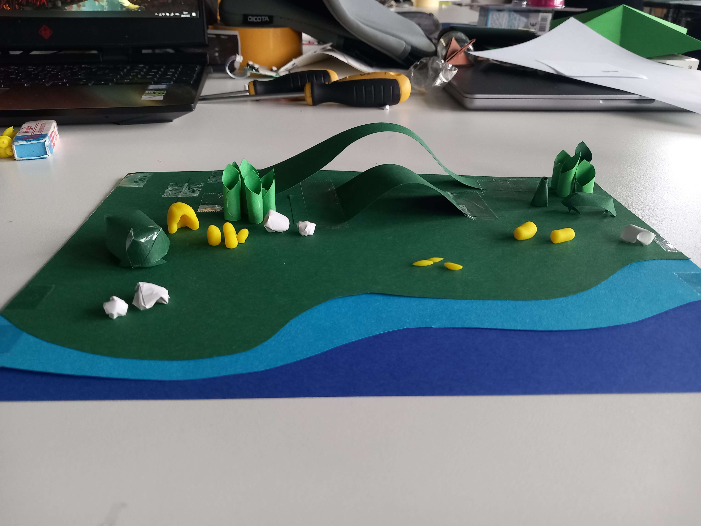
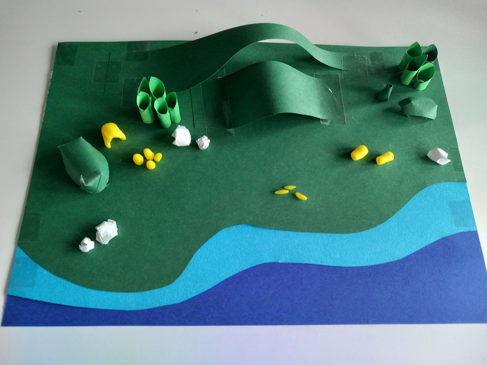

# Second day of workshop

- We thought about the sandbox idea we had the day before, thinking about what could make it interesting → generate mini stories
- Discussion with Camille about our ideas → the idea lacks an intention and/or a story
- Seance of ideation and first pitch (we’re not convince about it)
- First iteration of world (paper and playdough), thinking about what could be in it, which materials for the mockup
- Impression of being in a dead end, second ideation round (puppet, time manipulation, narrative sandbox, communication puzzle)

  

*[➤ Next devlog](./2023-05-10-log.md)*