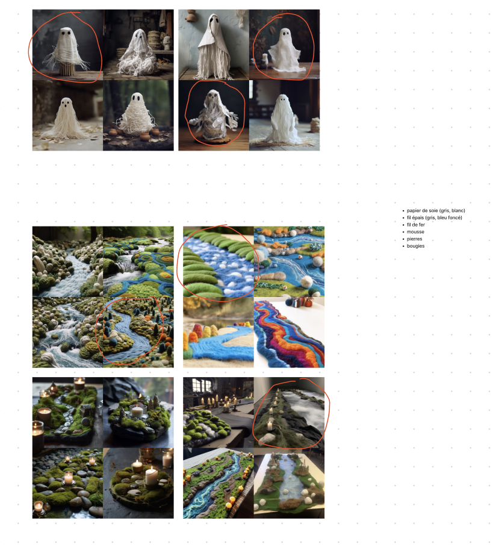
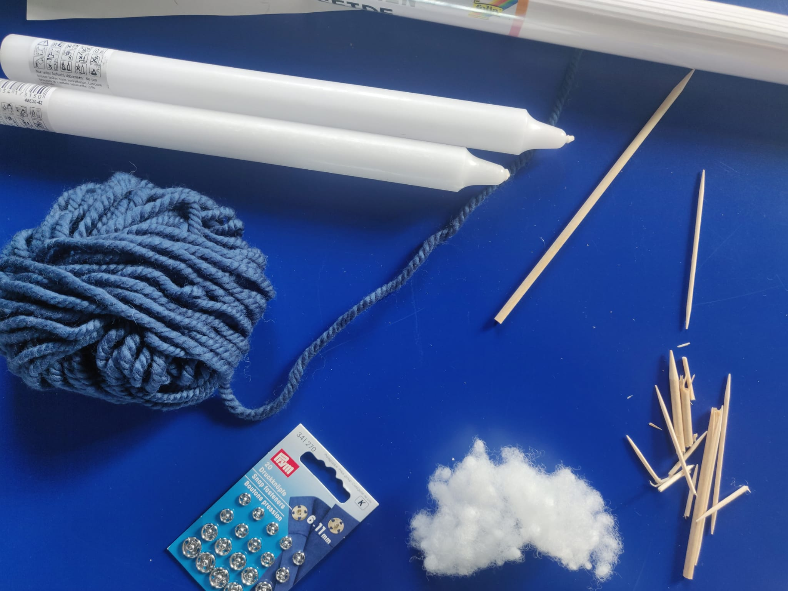
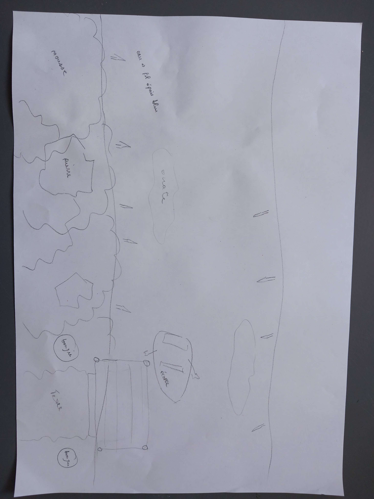
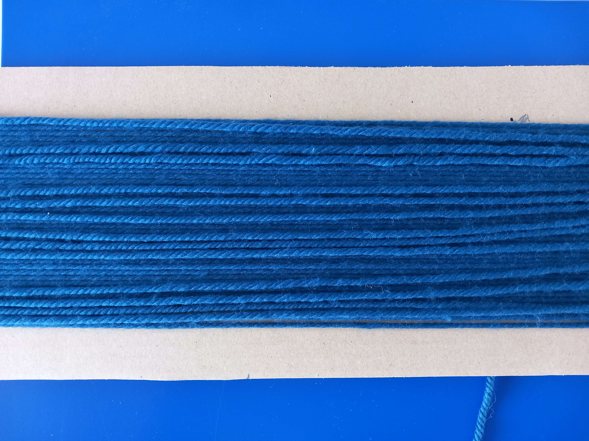
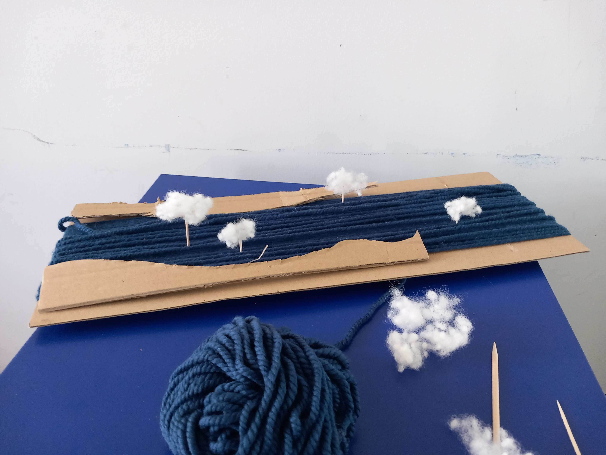

# Fourth day of workshop

**Prototyping**

- We began to work on the maquette with the new story
- Research of elements, materials and scene
- We went to collect a part of the needed materials (wool thread, weeding, kind of  coins, candles, silk paper)

 

- We made the scene container with some cardboard and then began to prototype a river with some blue wool.

 

 

**Discussion with Douglas and Pierre**

- The story is simple but effective. The user will probably quickly understand the story
- It would be interesting to create a way to add movement to the river in the maquette (even if it is done by hand)
- We should try very soon to scan the elements we already have to see if it fits well with others and if the scale changes works well
- It would be cool to have some physical element to hold while doing the VR interaction (paddle, rope)

**Todo**

To collect : 
- moss (environment)
- rocks (environment)
- bark and wood (boat, dock)
- dirt (environment)

To try with the mockup :
- attach the wool thread to rollers to simulate the movement of water

*[➤ Next devlog](./2023-05-15-log.md)*