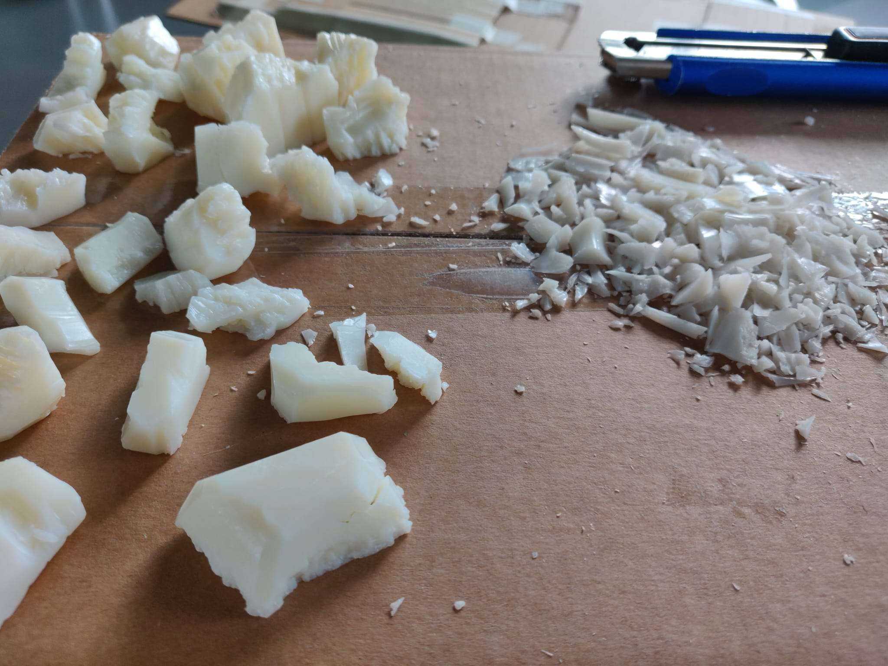

# Fifth day of workshop

**Discussion with Camille**
- Think about what bring the obole interaction
- Think about how to integrate the absorbent cotton so as not to cover the water and break the effect
- Water in multiple smaller module instead of one big module?
- Alternative material for the shore (instead of figurative ones) ?

**Discussion with Sabrina**
- Explained the project 
- Talked about the reasons behind some choices made → tell a story through the interactions, in 3 parts? (reassure → keep out lost souls → make leave the boat???)
- We want to create more empathy between the wandering soul and us

**Maquette**
- Continue the reflexion around the river and the movement with the blue wool
- Started working on the final river
- Created a way to move the water with two cardboard rolls
- Changed materials some parts (broken green glass instead of moss, soap instead of rocks, old paper for the boat)
- Started to make rocks for the shore with some soap
- Iterated on souls
- Iterated on boats

**Todo**
- buy more blue wool

*[➤ Next devlog](./2023-05-16-log.md)*