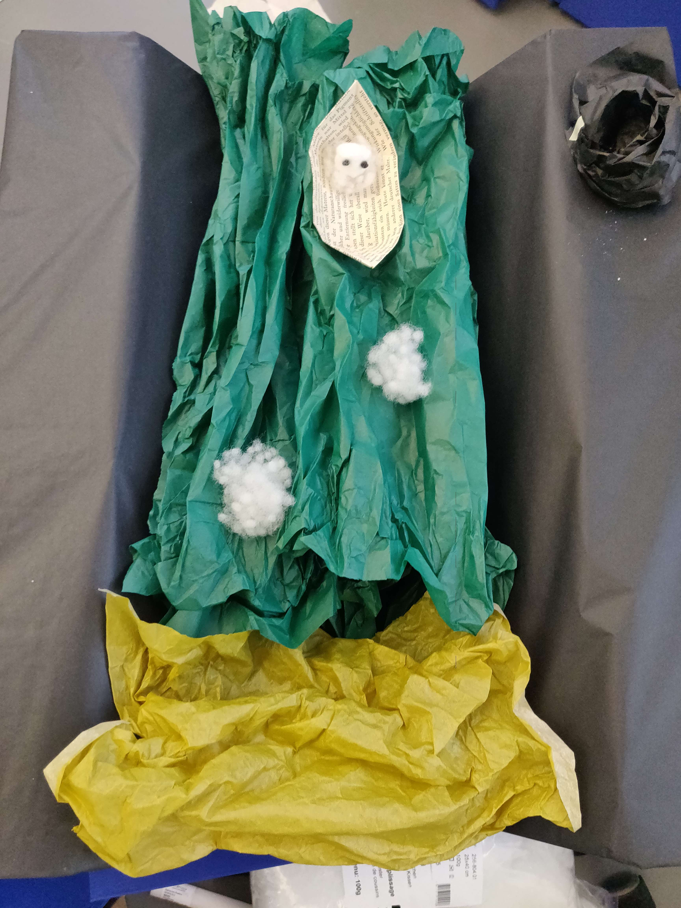
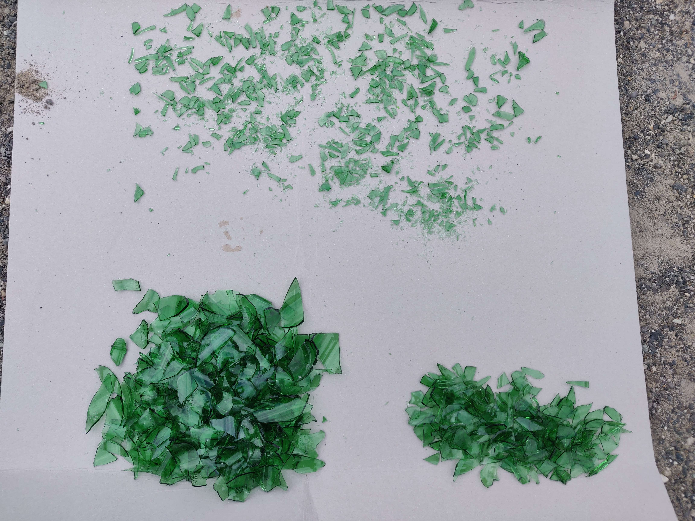
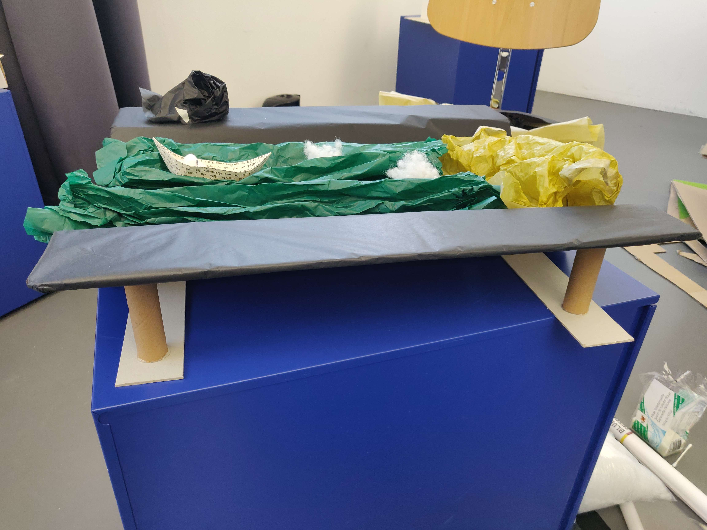

# Sixth day of workshop

**Discussions**
- Decided to replace the wool water with silk paper
- Finally the materials used for the maquette are silk paper, soap, glass, paper and weeding

**Maquette**
- Smashed beers bottle to have small pieces of green glass
- Bought some green silk paper to make the river water
- Found some old books to make the paper boat with
- Built the cardboard structure
- Built the cardboard structure and the boat

**Todo**
- Finish building the maquette
- Set the river (with the silk paper)
- Set the shore with glass and soap
- Scan the assets

*[➤ Next devlog](./2023-05-17-log.md)*