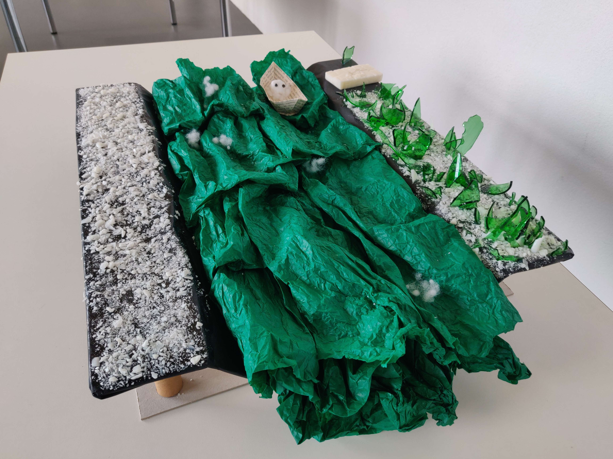

# Seventh day of workshop

**Maquette**
- Made the first shore with broken glass and soap
- Made the water with silk paper

**Presentation**
- Explained the concept and showed the progress to everyone
- Feedbacks: start to scan the boat and the water to see how it looks with the oculus in Unity

→ [Scan](https://poly.cam/capture/e91cb6f2-964b-4342-bd7a-f775778ff3bf) of the day 