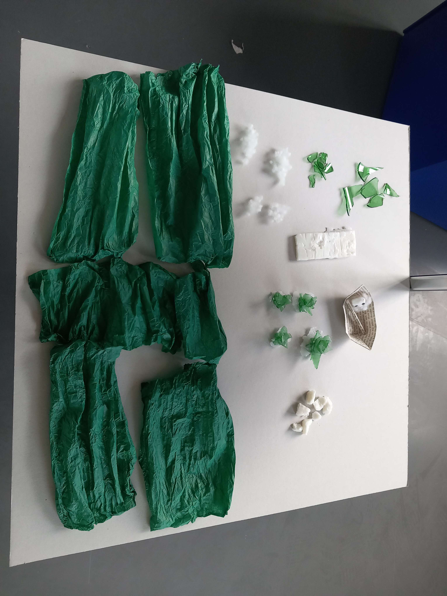
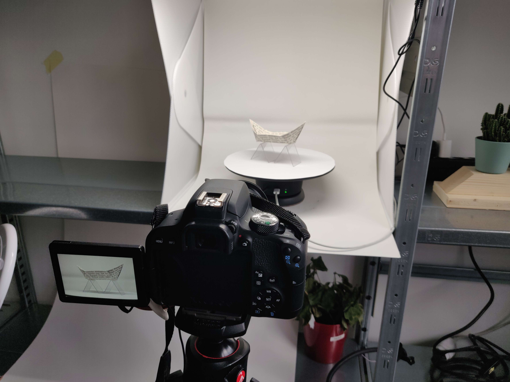
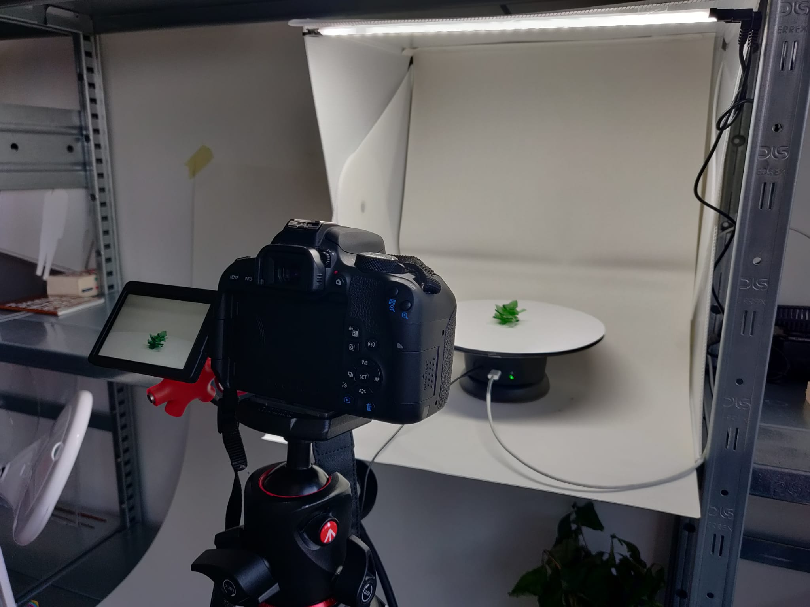

# Ninth day of workshop

**3D Scans**

Prepared pieces to scan :
- boat
- oar
- water (6x)
- broken glass (small 6x, big 4x)
- broken glass structure (4x)
- soap rock (7x)
- dock
- weeding (4x)
- soul

Scanned :

- boat
- water (2x)
- oar
- broken glass structure (1x)

