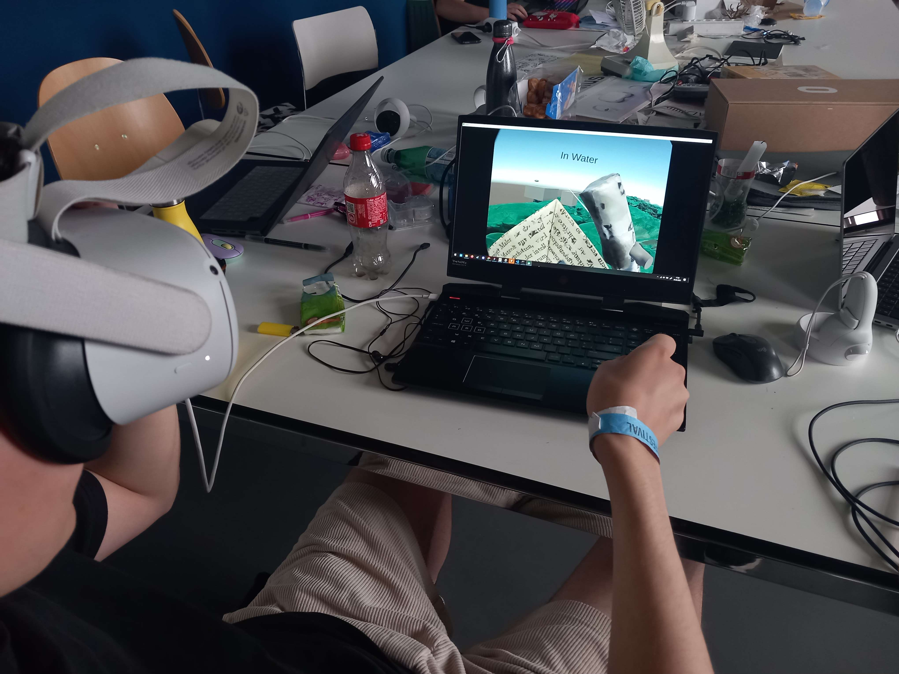

# 15th devlog

- Reworked scans (remove supports and multiple polygon reduction)
- Greyboxing (rowing interaction, game states, soul)
- Started to work with water
- Automatic generation and delete of parcels of water in order to have an infinite experience
- V1 and tests

