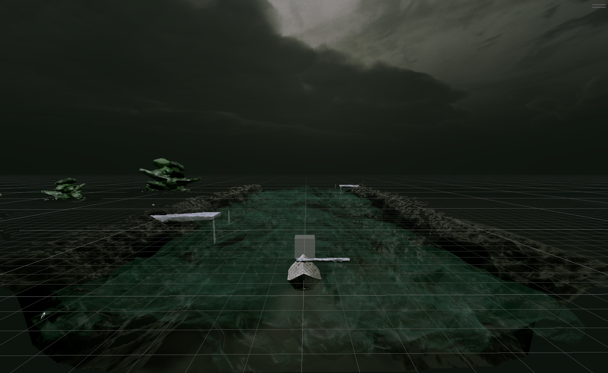

# 17th devlog

- Scanned another rock for the shores
- Made the shores and added them in the scene
- Worked on the color post processing settings
- Changed the water to make it more “spectral”
- Add new soul animation (for the docks)
- Made first sound records

