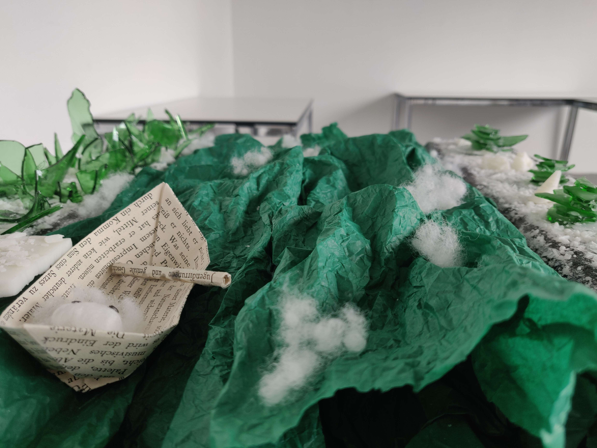
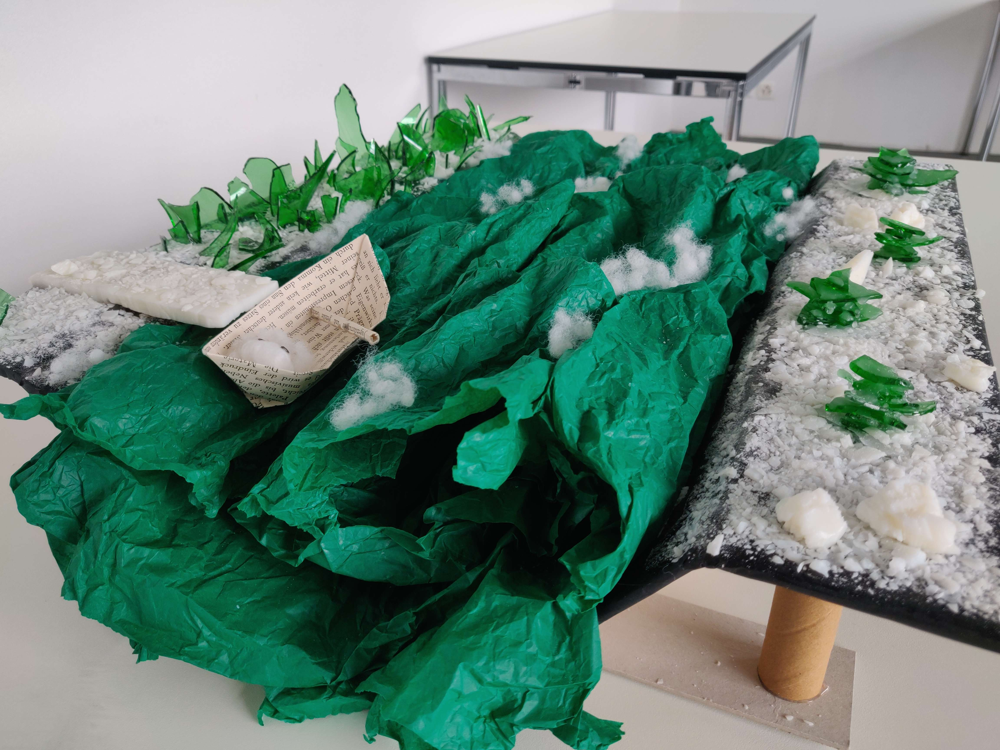
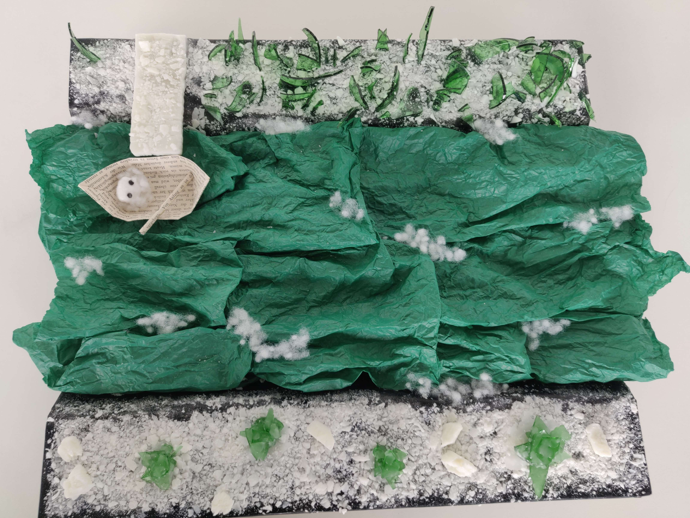

# Psychopomp's Pledge
- Nathan Zweifel, Louka Najjar
- Master Media Design, HEAD–Genève

## Pitch
As a psychopomp, your sacred duty is to guide departed souls to the afterlife. Today, your charge is a child, awaiting their passage across the spectral river. This voyage demands careful handling, as you navigate the spectral river and protect the young soul in your care.

Embark on this solemn journey with three key tasks. First, accept the obol, the traditional fare from your young passenger, initiating their passage. Then, navigate through the spectral river using hand gestures to row, guiding the boat forward whilst shielding the child from any lost souls attempting to intrude. Finally, gently encourage the child to disembark at their new resting place, completing their journey and setting their soul free.

## Synopsis

The experience starts as you are the Psychopomp waiting for a new soul to lead. Those are made of weeding more or less compressed. It takes place in a river surrounded by two shores. Both have different structures made of glass and soap on them. The water is made of silk paper and move around constantly depending of the what happen in the game. You stand on a boat made of old paper and have an oak made of paper as well. There is a dock made of soap on each shore from which you start and end the experience. Wandering souls made of weeding roam around the stage.

## Visual Interaction Loop
You spawn in the boat, sees the child soul arriving, when the child soul gets at the dock, the obole float in the air before it, waiting to be picked up. You **pick up** the obole and and **drop it** in the boat. Then the child soul gets on the boat in front of you. You **pick up** the boar and start **rowing**. After a while, the boat gets attacked on both sides, the child soul is panicked and you can’t row anymore. **Push towards** them to make the attacking souls leave. After they all left, you can row again for a while. You get to the arrival dock. You **make bye signs** to make the soul leave and then the child soul shine and disappear.

## POV
- The psychopomp, sitting in the boat

## Assets
- Models
    + The boat
    + The oar
    + The dock
    + The soul
    + Some water pieces
    + Some broken glass (small and big)
    + Some broken glass structures
    + Some soap rocks
    + Some weeding pieces

- Gestures
    + Row → with one oar to make the boat move
    + Pick up and drop → the obole to make the soul get in the boat
    + Push away → keep souls away
    + Bye sign → to make the soul leave

- Sounds
    + Sound of the water
    + Sound of the oar pushing the water
    + Sound of the child soul (idle + crying)
    + Sound of the obole (picking up + letting down)
    + Sound of the souls (attacking + leaving)

## State Machines
**Game Manager :**
- WaitingForTheSoul
→ Obole is available
- PickingUpObole
→ Obole is dropped in the boat
- SoulEmbark
→ Soul is at its place in the boat
- FirstRowing
→ Enter the attack zone
- AttackedBySouls
→ Enough souls have been defeated
- SecondRowing
→ Arrived at dock zone
- SoulLeaveBoat
→ Soul arrive at the dock and look at you
- Goodbye
→ You make a goodbye sign
- SoulRelease

**Child soul :**
- Arrive
- GivingObole
- Idle
- Fear
- Leave
- Released

**Water :**
- Calm
- Raging

**Angry soul :**
- Arrive
- Attack
- Leave

**Oar :**
- Grabbed
- Idle

- Fear
- Cry
- Leave

**Water :**
- Calm
- Raging

**Angry soul :**
- Arrive
- Attack
- Leave